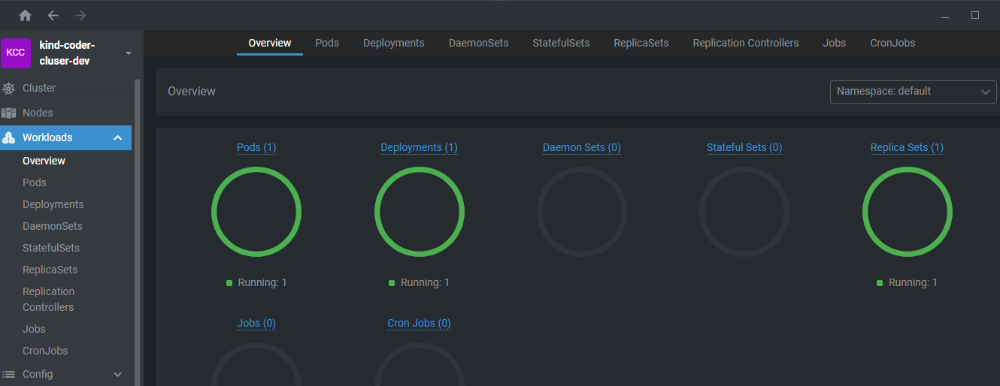
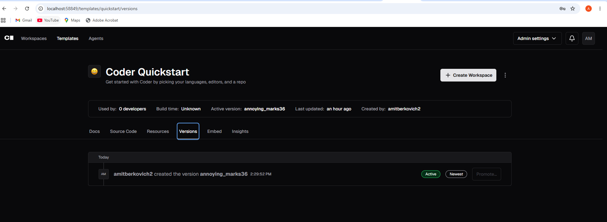
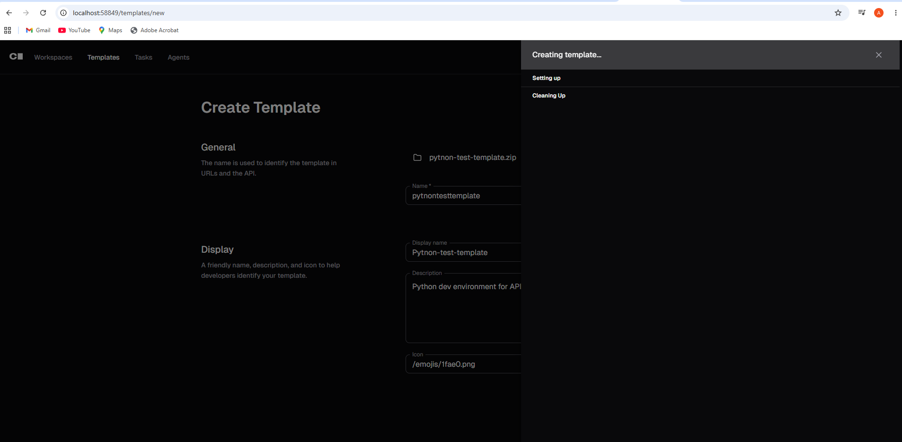

# Coder Deploying and Using
## Deployment
I started from searching a public chart for deploying coder. <br>
Chatgpt suggested to add the chart using the following commands <br>
<br>

```bash
helm repo add coder https://helm.coder.com
helm repo update
```
<br>

I did that then deploied the chart using ***Kind*** cluster and ***openlens*** <br>
Then I did port-forward to view coder on my computer <br>
At first I had a problem that the only page I could was the login page but I did't had a user to login with. <br>
I tried to solve it in many ways after finally coming across a newer version of the chart which did not had that problem. <br>
I deploied it on my openlens cluster as you can see in the following picture: <br>


<br>

After that I could access the to the coder UI on my computer, with a sign up page. <br> 
I entred my email and password I could finally reach coder fatures <br>


<br> 
## Python Template
After depolying coder I started researching on how to make my own template for creating a basic devlopment environment that will be serve as a good basic python API project.
<br>
<br>
I wanted the configured environment to consist of a few things:
- core os packages:
    - git
    - curl
    - python3 (for running projects)
- docker environment
    - cli
    - daemon
- Python Development Environment
    - .venv to be created automatically
    - popular packages to be installed (like uvicorn, fastapi, pytest)
- Built-in IDE
- Project structure to be created for developers
- Cloning a desired ready git project to the environment

I don't really knows how to work with terraform configuraton files, or bash script so I mainly worked with AI to create the template files that you see in this repo.
<br>

I then created a zip folder containing all those files and uploaded it to coder and to this repo<br> 
Don't really knows if it works caue every time I tried to create the template it was stuck on creating without any error
<br>



## Bonus Question

Because I got stuck on creating my python templae I couldn't really advance to the bonus question.
<br>

In order to solve it, what I think should be done is adding a featute to the cli to run containers in a remote host.
<br>

The cli should get credntials for the remote host in addition to the path of the running directory, then connect to is using SSH.
<br>

After connection to the host we can simply run the same logic we ran localy.
<br>
That way we eill be able to create a running container for a remote app devloped on our ***Python Template***